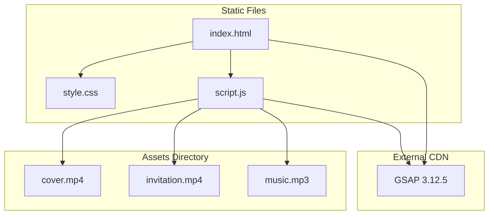
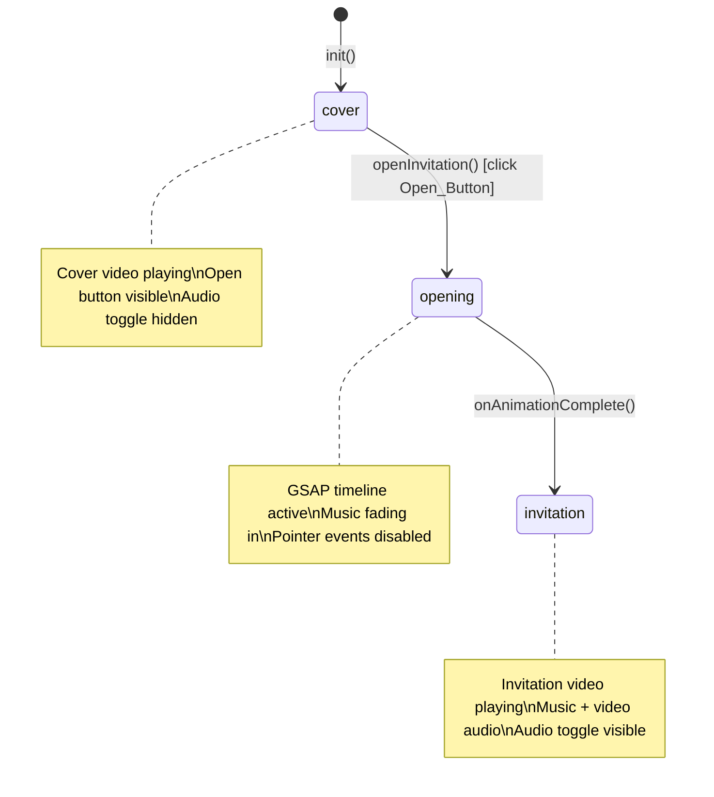
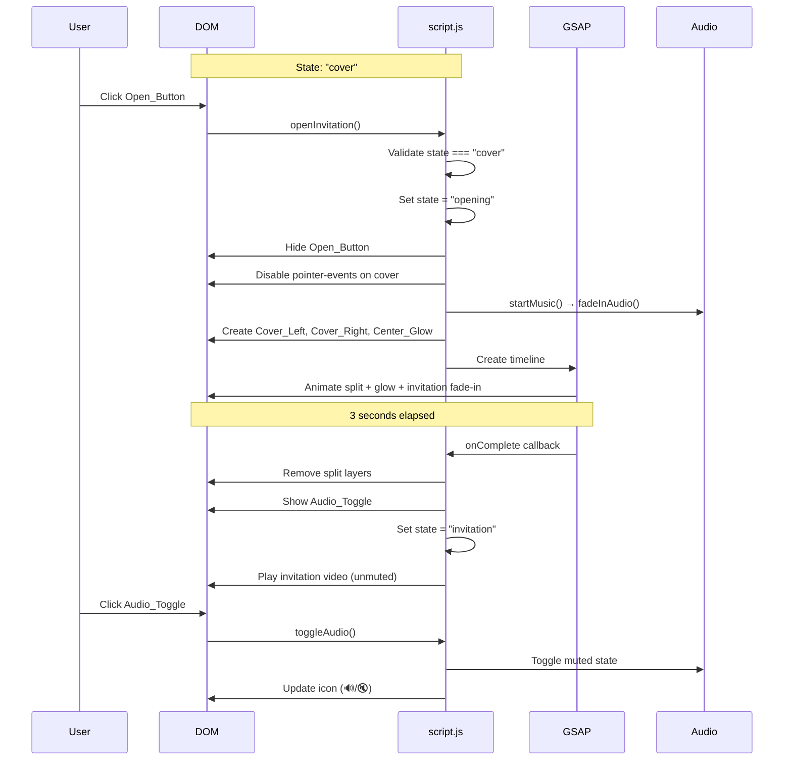
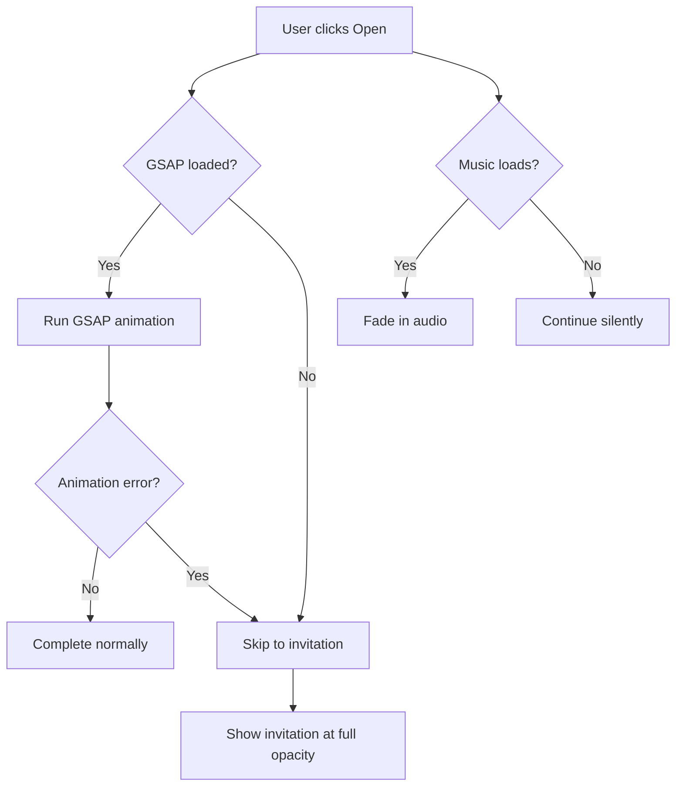

# Design Document: Alice in Wonderland Invitation

## Overview

This design describes a premium interactive digital invitation website for a 15th birthday party themed "Alice in Wonderland." The application delivers a cinematic experience through three discrete states: a cover screen with looping video, a GSAP-powered split-screen opening animation, and a full-screen invitation video reveal with background music.

The architecture is intentionally minimal — three static files (HTML, CSS, JS) with no build tools or frameworks. GSAP is loaded via CDN exclusively for the timeline-based opening animation. The application manages state transitions, video playback, audio fade-in, and responsive layout using vanilla web APIs.

### Key Design Decisions

1. **No framework**: The scope is a single-page cinematic experience with no routing, data fetching, or component reuse. Vanilla JS keeps the bundle minimal and deployment trivial (static file hosting).
2. **GSAP via CDN**: CSS animations cannot coordinate parallel clip-path + translate + opacity sequences with the precision needed. GSAP's timeline API provides frame-accurate synchronization with graceful fallback if the CDN fails.
3. **CSS clip-path for split effect**: Hardware-accelerated, no canvas overhead, works across modern browsers. The polygon-based clip creates clean geometric splits without image duplication artifacts.
4. **State machine pattern**: Three states with two valid transitions prevent race conditions from rapid clicks and provide a clear mental model for the animation lifecycle.

## Architecture



### State Machine



### Layer Stack (z-index)

| Layer | z-index | Description |
|-------|---------|-------------|
| Invitation_Screen | 1 | Base layer, always in DOM |
| Cover_Screen | 10 | Overlays invitation until animation |
| Cover_Left / Cover_Right | 20 | Clipped halves during animation |
| Center_Glow | 25 | Radial gradient overlay |
| Open_Button | 30 | CTA on cover |
| Audio_Toggle | 9999 | Always on top |

## Components and Interfaces

### HTML Structure

```html
<!DOCTYPE html>
<html lang="pt-BR">
<head>
    <meta charset="UTF-8">
    <meta name="viewport" content="width=device-width, initial-scale=1.0">
    <title>Alice XV - Convite</title>
    <link rel="stylesheet" href="style.css">
</head>
<body>
    <!-- Invitation Screen (base layer) -->
    <div id="invitation-screen" class="screen">
        <video id="invitation-video" src="assets/invitation.mp4" 
               playsinline loop preload="auto"></video>
    </div>

    <!-- Cover Screen (overlay) -->
    <div id="cover-screen" class="screen">
        <video id="cover-video" src="assets/cover.mp4" 
               autoplay muted loop playsinline></video>
        <button id="open-button" aria-label="Clique para abrir o convite">
            CLIQUE PARA ABRIR
        </button>
    </div>

    <!-- Audio Toggle (fixed, top-right) -->
    <button id="audio-toggle" class="hidden" aria-label="Alternar áudio">
        🔊
    </button>

    <!-- Background Music -->
    <audio id="background-music" src="assets/music.mp3" preload="auto"></audio>

    <!-- GSAP CDN -->
    <script src="https://cdnjs.cloudflare.com/ajax/libs/gsap/3.12.5/gsap.min.js"></script>
    <script src="script.js"></script>
</body>
</html>
```

### JavaScript Module Interface

```javascript
// State Management
let appState = "cover"; // "cover" | "opening" | "invitation"

// Public Functions
function init()              // Register listeners, set initial state
function openInvitation()    // Trigger cover→opening transition
function startMusic()        // Load and begin music playback
function fadeInAudio()       // Fade music volume 0→0.5 over 2s
function toggleAudio()       // Mute/unmute toggle

// Internal Functions
function createSplitLayers()     // Clone cover video into left/right halves
function runOpeningAnimation()   // Execute GSAP timeline
function onAnimationComplete()   // Cleanup and transition to invitation
function handleGSAPFallback()    // Skip animation if GSAP unavailable
```

### CSS Architecture

```
style.css
├── Reset & Base (body overflow:hidden, background)
├── Screen Containers (.screen - fixed, full viewport)
├── Video Elements (object-fit:cover, 100vw/100vh)
├── Open Button (positioning, glow, pulse animation)
├── Audio Toggle (fixed, circular, z-index:9999)
├── Split Animation Layers (.cover-left, .cover-right, .center-glow)
├── Utility Classes (.hidden, .no-pointer-events)
└── Responsive Breakpoints (768px, 1024px)
```

### Component Interaction Flow



## Data Models

### Application State

```typescript
// Conceptual type definitions (implemented as plain JS)

type AppState = "cover" | "opening" | "invitation";

interface StateTransition {
    from: AppState;
    to: AppState;
}

// Valid transitions (enforced at runtime)
const VALID_TRANSITIONS: StateTransition[] = [
    { from: "cover", to: "opening" },
    { from: "opening", to: "invitation" }
];
```

### Audio State

```typescript
interface AudioState {
    isPlaying: boolean;
    isMuted: boolean;
    volume: number;        // 0.0 to 1.0, target: 0.5
    fadeInterval: number | null;
}
```

### Animation Configuration

```typescript
interface AnimationConfig {
    duration: number;          // 3 seconds
    easing: string;            // "power4.inOut"
    glowFadeIn: number;        // 0.5 seconds
    glowFadeOut: number;       // 0.5 seconds
    invitationFadeIn: number;  // 1.5 seconds
    splitDistance: string;      // "100%" (translateX)
}

const ANIMATION_CONFIG: AnimationConfig = {
    duration: 3,
    easing: "power4.inOut",
    glowFadeIn: 0.5,
    glowFadeOut: 0.5,
    invitationFadeIn: 1.5,
    splitDistance: "100%"
};
```

### DOM Element References

```typescript
interface DOMElements {
    coverScreen: HTMLDivElement;
    coverVideo: HTMLVideoElement;
    invitationScreen: HTMLDivElement;
    invitationVideo: HTMLVideoElement;
    openButton: HTMLButtonElement;
    audioToggle: HTMLButtonElement;
    backgroundMusic: HTMLAudioElement;
}
```


## Correctness Properties

*A property is a characteristic or behavior that should hold true across all valid executions of a system — essentially, a formal statement about what the system should do. Properties serve as the bridge between human-readable specifications and machine-verifiable correctness guarantees.*

### Property 1: State machine transition validity

*For any* application state and *for any* attempted state transition, the transition SHALL succeed if and only if it is one of the two valid transitions (cover→opening, opening→invitation). All other transition attempts SHALL leave the application state unchanged.

**Validates: Requirements 10.1, 10.4, 10.5, 3.3**

### Property 2: Audio fade linear interpolation

*For any* time value t in the range [0, 2000ms], the audio volume during the fade-in SHALL equal `(t / 2000) * 0.5`, producing a linear interpolation from 0.0 to 0.5 over exactly 2 seconds.

**Validates: Requirements 6.2**

### Property 3: Audio toggle round-trip

*For any* audio state (muted or unmuted), toggling the audio twice SHALL restore the volume to its original value. Specifically: if volume is 0.5, toggle sets it to 0, and toggling again restores it to 0.5. If volume is 0, toggle sets it to 0.5, and toggling again restores it to 0.

**Validates: Requirements 7.4, 7.5**

## Error Handling

### GSAP CDN Failure

| Scenario | Detection | Recovery |
|----------|-----------|----------|
| GSAP script fails to load | `typeof gsap === "undefined"` check before animation | Skip animation, immediately set invitation screen to opacity 1, transition state to "invitation" |
| GSAP timeline throws error | try/catch around timeline creation | Same fallback as above |

### Media Load Failures

| Scenario | Detection | Recovery |
|----------|-----------|----------|
| cover.mp4 fails to load | `error` event on video element | Display dark blue (#0b1220) fallback background, button remains functional |
| invitation.mp4 fails to load | `error` event on video element | Display dark blue fallback background, state remains "invitation" |
| music.mp3 fails to load | `error` event on audio element | Continue animation and invitation display silently, hide audio toggle |

### User Interaction Edge Cases

| Scenario | Handling |
|----------|----------|
| Rapid double-click on Open_Button | State check in `openInvitation()` rejects if state ≠ "cover"; pointer-events disabled immediately |
| Click during animation | pointer-events: none on cover screen prevents interaction |
| Audio autoplay blocked by browser | Catch rejected `play()` promise, continue without audio, hide toggle |
| iOS Safari video restrictions | `playsinline` attribute + user gesture (click) triggers playback |

### Graceful Degradation Strategy



## Testing Strategy

### Testing Approach

This project uses a dual testing strategy:

1. **Property-based tests** — Verify universal correctness properties of the state machine and audio logic using generated inputs (100+ iterations per property)
2. **Example-based unit tests** — Verify specific DOM states, CSS properties, animation configuration, and integration behavior

### Property-Based Testing

**Library**: [fast-check](https://github.com/dubzzz/fast-check) (JavaScript property-based testing)

**Configuration**:
- Minimum 100 iterations per property test
- Each test tagged with: `Feature: alice-wonderland-invitation, Property {N}: {description}`

**Properties to implement**:

| Property | What it tests | Generator strategy |
|----------|---------------|-------------------|
| 1: State machine validity | Transition function accepts only valid pairs | Generate random (currentState, targetState) pairs from all 9 combinations |
| 2: Audio fade interpolation | Volume calculation at any point in time | Generate random integers in [0, 2000] for time values |
| 3: Audio toggle round-trip | Double-toggle restores original state | Generate random initial muted/unmuted states and toggle sequences |

### Example-Based Unit Tests

**Framework**: Vitest (lightweight, no-config for vanilla JS)

**Test categories**:

| Category | What it covers | Example tests |
|----------|---------------|---------------|
| DOM Structure | HTML elements and attributes | Video elements have correct attributes, button text content |
| CSS Properties | Computed styles | object-fit: cover, position: fixed, overflow: hidden |
| State Initialization | init() behavior | State starts as "cover", listeners registered |
| Animation Config | GSAP timeline setup | Duration === 3s, easing === "power4.inOut" |
| Responsive | Breakpoint behavior | Font sizes at 320px, 768px, 1024px viewports |
| Error Handling | Fallback paths | GSAP undefined → skip animation, audio error → continue |

### Test File Structure

```
tests/
├── state-machine.property.test.js    # Property 1
├── audio-fade.property.test.js       # Property 2
├── audio-toggle.property.test.js     # Property 3
├── dom-structure.test.js             # DOM and attribute checks
├── animation-config.test.js          # GSAP timeline verification
├── responsive.test.js                # Breakpoint behavior
└── error-handling.test.js            # Fallback scenarios
```

### What Is NOT Tested

- Visual appearance (colors, gradients) — verified by manual review
- Video playback quality — depends on source files
- Actual animation smoothness — GSAP handles frame timing
- Cross-browser rendering — verified by manual testing on target devices
